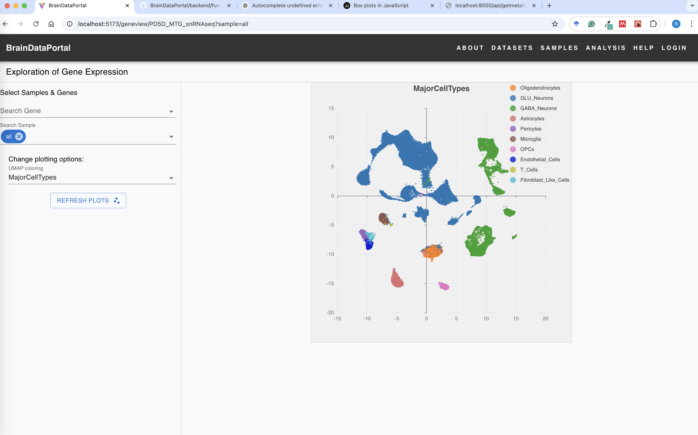
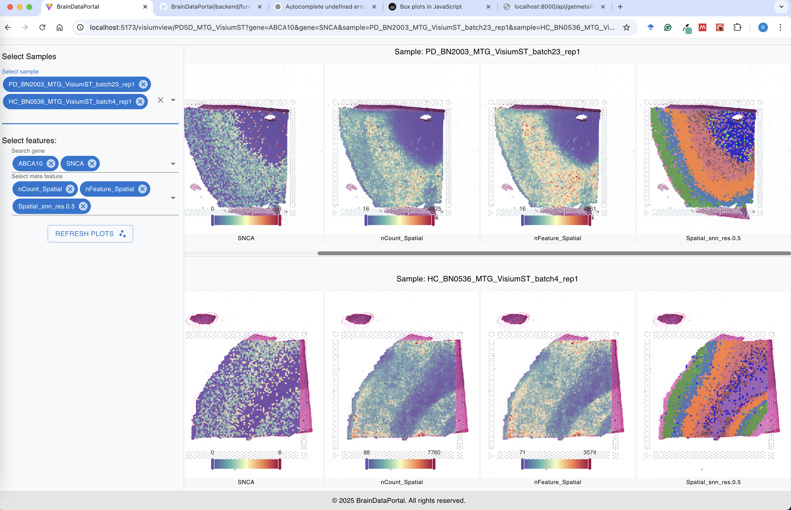

## BrainDataPortal

### NOTES:
- 1. Load all the meta data when first load the page, separate the meta data into cell level and sample level
- 2. To reduce the size of the meta data file, meta file only save an index/key of the meta string. And the actual meta data is stored in a JSON file (Dict).


### Overview
- This is project designed for the brain data analysis and visualization.
- The data assays include: scRNAseq, scATACseq, ChIPseq, Spatial Transcriptomics and other omics data.
- The backend is using [FastAPI](https://fastapi.tiangolo.com/) and [uvicorn](https://www.starlette.io/).
- The frontend is using [React](https://react.dev/) and [Vite](https://vitejs.dev/).
- The data is stored in [PostgresSQL](https://www.postgresql.org/) and JSON files.
- Use zustand for state management, and material ui for design

### How to use

1. Clone the repository.
2. Install dependencies.
   - In the frontend directory.
   
       ```npm install```
   - In the backend directory.

       ```pip install -r requirements.txt```
3. Run the backend, in the BrainDataPortal directory.

   ```python -m uvicorn backend.main:app --reload --host 0.0.0.0 --port 8000 ```
4. Run the frontend, change to frontend directory.

   ```npm run dev```
6. Use the frontend.

   - Navigate to http://localhost:5173
   - Use the navigation bar to navigate to different pages.

### Demo page
[//]: # ([BrainDataPortal]&#40;https://braindataportal.vercel.app/&#41;)
#### Home Page


#### Single Cell UMAP clustering


#### Spatial Transcriptomics


