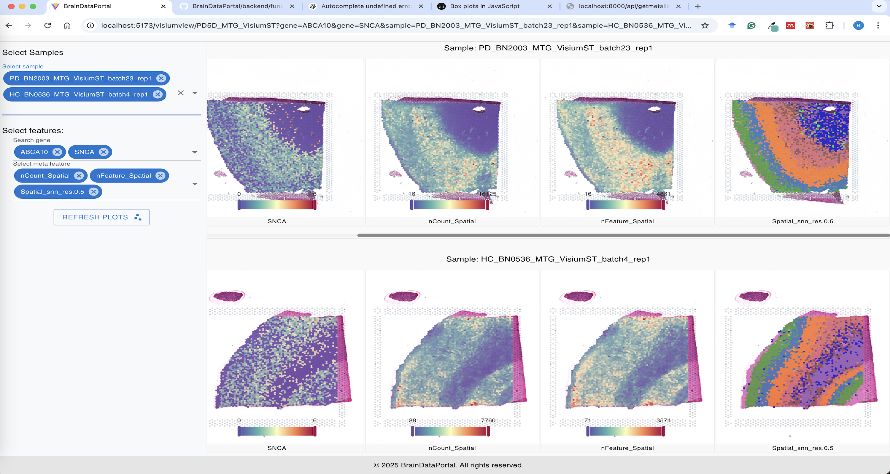

# BrainDataPortal

### NOTES:
- 1. Load all the meta data when first load the page, separate the meta data into cell level and sample level
- 2. To reduce the size of the meta data file, meta file only save an index/key of the meta string. And the actual meta data is stored in a JSON file (Dict).


## Overview
- This is project designed for the brain omics data analysis and visualization.
- The data assays include: scRNAseq, scATACseq, ChIPseq, Spatial Transcriptomics and other omics data.
- The backend is using [FastAPI](https://fastapi.tiangolo.com/) and [uvicorn](https://www.starlette.io/).
- The frontend is using [React](https://react.dev/) and [Vite](https://vitejs.dev/).
- The data is stored in [SQLite3](https://www.sqlite.org/) and JSON files.
- Use zustand for state management, and Material UI for web page layout design

## How to use

### 1. Prerequisites
Before you begin, ensure you have the following installed on your system:
- Python 3.10 or higher: Required to run the backend
- Node.js 18 or higher: Required to run the frontend
- [Optional]Conda: Set up a virtual environment
- [Optional]Git: Clone the repository

### 2. Setup from GitHub
1. Clone the repository.
   - ```git clone https://github.com/BrainDataPortal/BrainDataPortal.git```
   - Or, download the zipped repository from https://github.com/huruifeng/BrainDataPortal

2. Setup backend environment.
   - [Optional] Create a virtual environment.
   
       ```conda create -n braindataportal python=3.10```
   
       ```conda activate braindataportal```
   - Change to the __BrainDataPortal/backend__ directory.
   - Install dependencies.
   
       ```pip install -r requirements.txt```
3. Run the backend.
   - Make sure you are in the ROOT (e.g., BrainDataPortal) directory, NOT the backend folder
   - __Option 1__: Run the backend server in the terminal.
      ```bash
      uvicorn backend.main:app --host 0.0.0.0 --port 8000 --workers 4 --proxy-headers
      # The above command will start the backend server on port 8000
      # The --proxy-headers option is required to enable CORS
      # The --workers option specifies the number of worker processes
      # The --host option specifies the host IP address, Default is 127.0.0.1
      #     0.0.0.0 means listening on all IP addresses.
      #     Use 127.0.0.1 for listening on localhost.
      # The --port option specifies the port number, Default is 8000
      #     This port number is used to access the backend server
      #     It will be used in the frontend code, or in proxy server setup
      #     MAKE SURE THE PORT IS NOT BLOCKED.
    
      # Stop the backend server
      <Ctrl + C> - Press Ctrl+C in the terminal to stop the backend server
      ```
   - __Option 2__: Run the backend server in the background using nohup.
     ```bash
     nohup uvicorn backend.main:app --host 0.0.0.0 --port 8000 --workers 4 --proxy-headers >> backend.log 2>&1 &
      # The '>> backend.log 2>&1 &' redirects the output to a log file
      # The & runs the command in the background
    
      # To stop the backend server, use the following command:
      kill -9 $(lsof -t -i:8000)
      ```
4. Setup frontend.
   - Set global environment variables in the .env file (frontend/env/.env).
     ```bash
      # .env - Global settings, always loaded
      VITE_APP_TITLE = BrainDataPortal
      VITE_PORT = 3000
      # This port number is used to access the frontend server, it is different from the backend port
      ``` 
   - __Option A__: Run the frontend in the <u>development</u> mode.
     - Set environment variables in the .env.development file (frontend/env/.env.development).
       ```bash
       # .env.development - Development settings
       # Run the App locally or in the cloud in dev mode
       VITE_BACKEND_URL = http://<backend-running-ip>:8000
       # The <backend-running-ip> is the IP address where the backend server is running
       # If the backend server is running locally, use 127.0.0.1 or localhost
       # The 8000 is the port number where the backend server is running on, adjust it if needed
       ``` 
     - Run the frontend locally or in the cloud in dev mode.
       ```bash
       # Navigate to the frontend directory
       cd BrainDataPortal/frontend
    
       # Install dependencies
       npm install
    
       # ==============================
       # [Option 1] Running the frontend server in terminal:
       # Start development server
       npm run dev
       # The above command will start the frontend server on port 3000
       # you can access the frontend at http://<frontend-running-ip>:3000
    
       # Stop the frontend server
       <Ctrl + C> - Press Ctrl+C in the terminal to stop the frontend server
    
       # ==============================
       # [Option 2] Running the frontend server in the background:
       nohup npm run dev >> frontend.log 2>&1 &
    
       # To stop the frontend serverrunning in the background, use the following command:
       kill -9 $(lsof -t -i:3000)
       ```
   - __Option B__: Run the frontend in <u>production</u> mode (Without proxy server).
     - Set environment variables in the .env.production file (frontend/env/.env.production).
       ```bash
       # .env.production - Production settings
       # Run the App locally or in the cloud in production mode
       VITE_BACKEND_URL = http://<backend-running-ip>:8000
       # The <backend-running-ip> is the IP address where the backend server is running
       # If the backend server is running locally, use 127.0.0.1 or localhost
       # The 8000 is the port number where the backend server is running on, adjust it if needed
       ``` 
     - Build the frontend pages.
       ```bash
       # Navigate to the frontend directory
       cd BrainDataPortal/frontend

       # Install dependencies
       npm install

       # Build the frontend pages
       npm run build
       # This command will build the frontend pages in the frontend/dist folder
       ```
     - Deploy the frontend pages (Apache server or Nginx server)
       ```bash
       # Navigate to the frontend directory
       cd BrainDataPortal/frontend

       # Deploy the frontend pages
       sudo cp -r dist/* /var/www/html
       # This command will copy the frontend pages to the Apache server or Nginx server
       # The /var/www/html is the directory where the frontend pages are deployed
       # You may need to adjust the path (/var/www/html) depending on your Apache server or Nginx server configuration.
       # MAKE SURE THE DIRECTORY IS NOT BLOCKED.
       
       # You may create a subdirectory(e.g. /var/www/html/BrainDataPortal) in the root directory.
       # cp -r dist/* /var/www/html/BrainDataPortal.
       ```
   - __Option C__: Run the frontend in <u>production</u> mode (Nginx server with proxy service).
     - Set environment variables in the .env.nginx file (frontend/env/.env.nginx).
        ```bash
        # .env.nginx - Production settings
        # Run the App in the cloud in production mode
        VITE_BACKEND_URL = ''
        # The backend URL is an empty string, we will use the proxy service to proxy the requests to the backend
        ``` 
     - Build the frontend pages.
       ```bash
       # Navigate to the frontend directory
       cd BrainDataPortal/frontend

       # Install dependencies
       npm install

       # Build the frontend pages
       npm run build:nginx
       # This command will build the frontend pages in the frontend/dist folder
       ```
     - Setup the proxy service (Nginx server) (Example configuration file [bdpvite_nginx](bdpvite_nginx)):
       ```bash
       # if you are using the Ubuntu/Debian system
       # Create and edit /etc/nginx/sites-available/BrainDataPortal
       
       # if you are using the RHEL/CentOS system
       # Create and edit /etc/nginx/conf.d/BrainDataPortal.conf
       
       server {

           # Make sure THE PORT IS NOT USED!
           listen 80;
           server_name localhost;

           # Replace with the actual path to your frontend production folder, e.g., /var/www/html/BrainDataPortal/dist;
           root <path-to-your-frontend-production-folder> 
           index index.html;

           # frontend pages
           location / {
               try_files $uri /index.html;
           }

           # API requests - proxy to FastAPI
           location /api/ {
               proxy_pass http://localhost:8000; # Replace with your FastAPI server address (e.g., http://localhost:8000)
               proxy_set_header Host $host;
               proxy_set_header X-Real-IP $remote_addr;
               proxy_set_header X-Forwarded-For $proxy_add_x_forwarded_for;
           }

           # QTL requests - proxy to FastAPI
           location /qtl/ {
               proxy_pass http://localhost:8000;
               proxy_http_version 1.1;
               proxy_set_header Host $host;
               proxy_set_header X-Real-IP $remote_addr;
               proxy_set_header X-Forwarded-For $proxy_add_x_forwarded_for;
           }

           location /visium/ {
               proxy_pass http://localhost:8000;
               proxy_http_version 1.1;
               proxy_set_header Host $host;
               proxy_set_header X-Real-IP $remote_addr;
               proxy_set_header X-Forwarded-For $proxy_add_x_forwarded_for;
           }

           location /datasetmanage/ {
               proxy_pass http://localhost:8000;
               proxy_http_version 1.1;
               proxy_set_header Host $host;
               proxy_set_header X-Real-IP $remote_addr;
               proxy_set_header X-Forwarded-For $proxy_add_x_forwarded_for;
           }
       }
       ```
     - Enable the site  
       ```bash
       # Create a symbolic link to enable the site [for Ubuntu/Debian]
       sudo ln -s /etc/nginx/sites-available/BrainDataPortal /etc/nginx/sites-enabled/BrainDataPortal
       
       # Check Nginx configuration
       sudo nginx -t
       
       # Reload Nginx
       sudo systemctl reload nginx
      
       # Check Nginx status
       sudo systemctl status nginx
       ```
     - Disable the site  
       ```bash
       # Remove the symbolic link [for Ubuntu/Debian]
       sudo rm /etc/nginx/sites-enabled/BrainDataPortal
       
       # Remove the configuration file [for RHEL/CentOS]
       sudo rm /etc/nginx/conf.d/BrainDataPortal.conf
    
       # Restart Nginx
       sudo systemctl restart nginx
       
       # Check Nginx status
       sudo systemctl status nginx
       ```
### 3. Docker setup (Coming soon...)
1. pull the docker image
   ```bash
   docker pull braindataportal
   ```

2. Run the Docker container
   ```bash
   # Run the Docker container
   docker run -p 80:80 braindataportal
   ```
3. Access the frontend at http://localhost


----------------------------------      
## Demo page

### Home Page


### Single Cell UMAP clustering


### Spatial Transcriptomics


